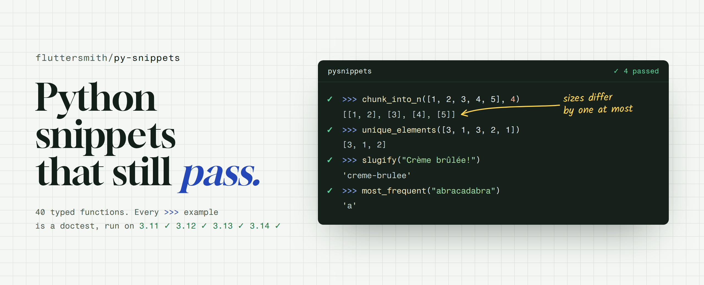
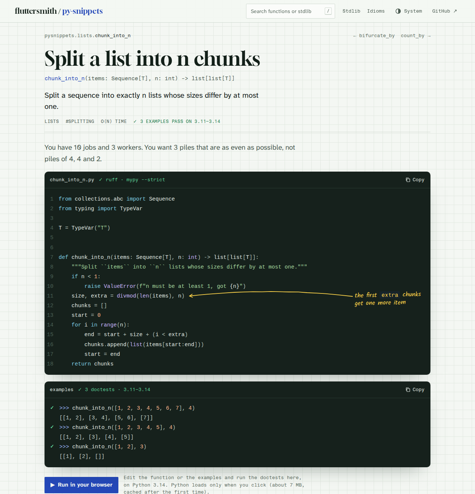
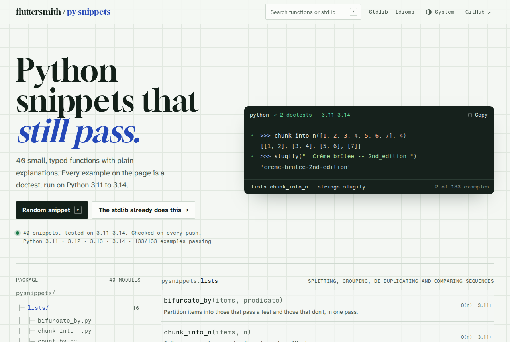
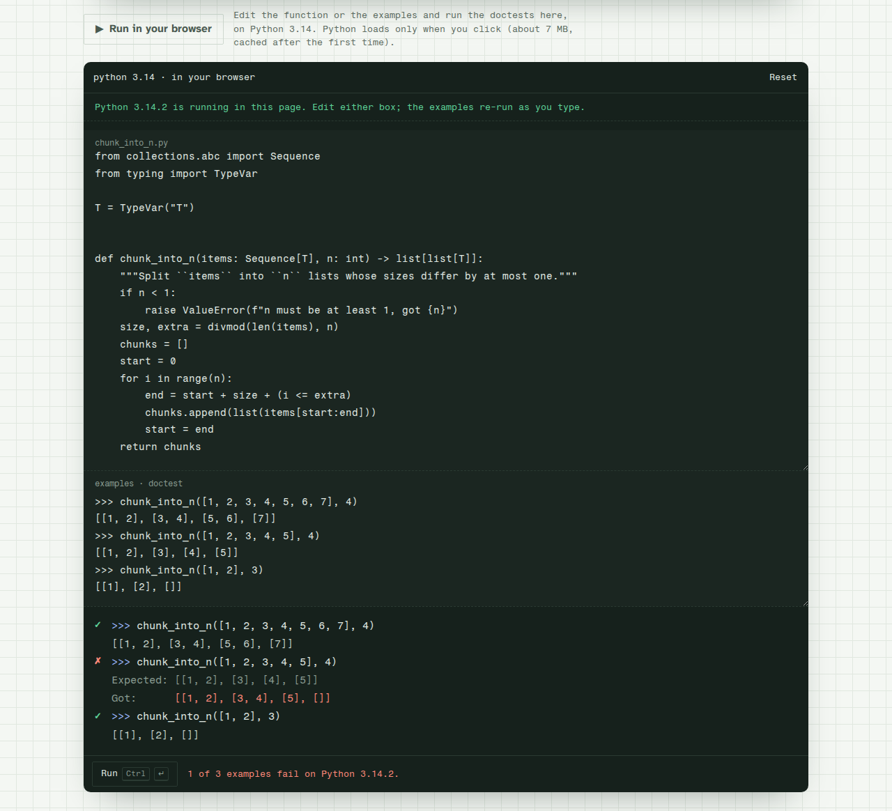
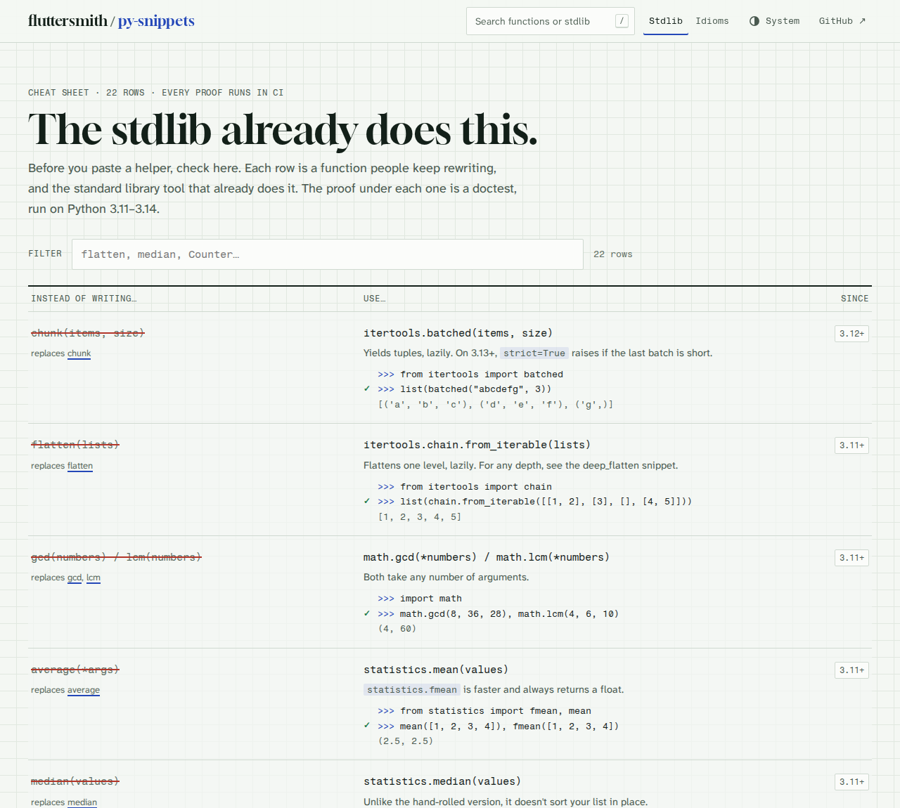
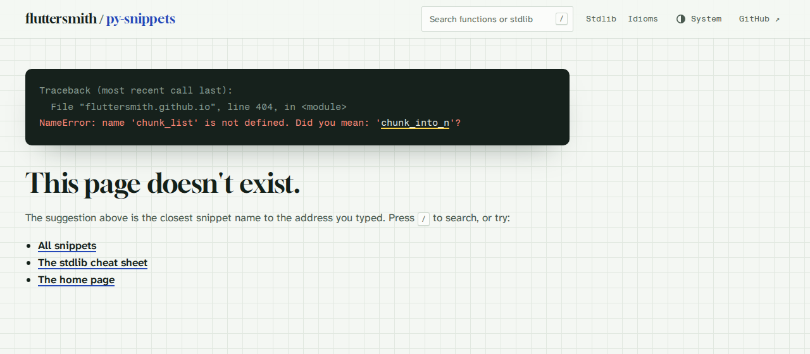
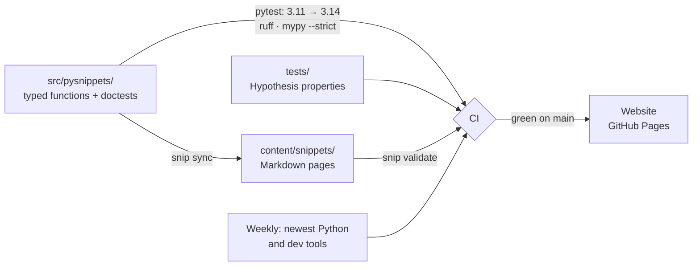

<a href="https://fluttersmith.github.io/py-snippets/">
  <picture>
    <source media="(prefers-color-scheme: dark)" srcset=".github/assets/banner-dark.png">
    
  </picture>
</a>

<p align="center">
  <a href="https://fluttersmith.github.io/py-snippets/"><b>Read on the web</b></a> ·
  <a href="CATALOG.md">All snippets</a> ·
  <a href="content/stdlib.md">The stdlib already does this</a> ·
  <a href="content/idioms.md">Idioms for JS developers</a> ·
  <a href="CONTRIBUTING.md">Add a snippet</a>
</p>

<p align="center">
  <a href="https://github.com/FlutterSmith/py-snippets/actions/workflows/ci.yml"></a>
  
  
  
  <a href="LICENSE"></a>
</p>

Small, typed Python functions for everyday jobs: splitting lists, inverting dicts, making slugs, counting months. Each one is a single file you can copy, with a short explanation of how it works and what it costs.

The difference from other snippet collections: **every example you see is a test.** The `>>>` lines are doctests, and CI runs them on Python 3.11, 3.12, 3.13 and 3.14 before anything ships. A wrong result can't reach the page. And when Python already has the tool for the job, we say so instead of shipping a worse copy.

## A snippet in thirty seconds

```python
def chunk_into_n(items: Sequence[T], n: int) -> list[list[T]]:
    """Split ``items`` into ``n`` lists whose sizes differ by at most one.

    >>> chunk_into_n([1, 2, 3, 4, 5, 6, 7], 4)
    [[1, 2], [3, 4], [5, 6], [7]]
    >>> chunk_into_n([1, 2], 3)
    [[1], [2], []]
    """
    if n < 1:
        raise ValueError(f"n must be at least 1, got {n}")
    # @note the first `extra` chunks get one more item
    size, extra = divmod(len(items), n)
    ...
```

On the website, the examples become a REPL panel with a tick per line that passed, and the `# @note` comments become handwritten margin notes. Press **Run in your browser** and the same doctests run live in the page (Pyodide), editable, going green or red as you type.



## What you get

| | |
|:--|:--|
| **Examples that are tests** | 133 `>>>` examples on the functions and 53 on the cheat sheets, run on four Python versions. |
| **Properties, not only examples** | [Hypothesis](https://hypothesis.readthedocs.io/) tests check the claims that matter, like "`chunk_into_n` never loses or reorders an item". 211 tests in all. |
| **Typed and clean** | `mypy --strict`, ruff, PEP 8, generics. No JavaScript-isms, no 2-space indents. |
| **Stdlib first** | [The stdlib already does this](content/stdlib.md): 22 helpers people keep rewriting, and the built-in that already does each one. |
| **Honest about cost** | Every page states its time and space complexity and its edge cases. |
| **Fixed, and says so** | Where the original snippet had a bug, the page shows what it got wrong. |
| **Run it in the page** | One click loads Python into your browser. Edit the code or the examples and re-run. |

## A quick tour

<table>
  <tr>
    <td width="50%"></td>
    <td width="50%"></td>
  </tr>
  <tr>
    <td><b>Home.</b> The index is the package tree: real module names, real counts.</td>
    <td><b>Run.</b> Python's own doctest runner, in your browser. Break the code and watch the tick turn red.</td>
  </tr>
  <tr>
    <td></td>
    <td></td>
  </tr>
  <tr>
    <td><b>Stdlib cheat sheet.</b> Before you copy a helper, check here.</td>
    <td><b>Not found.</b> A traceback, with a real "Did you mean".</td>
  </tr>
</table>

## The snippets

<!-- snip:catalog -->

**40 snippets** in 5 categories.

<details>
<summary><b>Lists</b> · 16</summary>

- [Split a list in two with a predicate](content/snippets/bifurcate-by/index.md): `bifurcate_by()`
- [Split a list into n chunks](content/snippets/chunk-into-n/index.md): `chunk_into_n()`
- [Count items by a key](content/snippets/count-by/index.md): `count_by()`
- [Flatten a nested list of any depth](content/snippets/deep-flatten/index.md): `deep_flatten()`
- [List difference by a key](content/snippets/difference-by/index.md): `difference_by()`
- [Find duplicate and single values](content/snippets/duplicates/index.md): `duplicates()`, `singles()`
- [Every nth item of a list](content/snippets/every-nth/index.md): `every_nth()`
- [Group items by a key](content/snippets/group-by/index.md): `group_by()`
- [Check a list for duplicates](content/snippets/has-duplicates/index.md): `has_duplicates()`
- [Check two lists hold the same items](content/snippets/have-same-contents/index.md): `have_same_contents()`
- [Find every index of a value](content/snippets/index-of-all/index.md): `index_of_all()`, `find_index_of_all()`
- [List intersection by a key](content/snippets/intersection-by/index.md): `intersection_by()`
- [Find the most frequent value](content/snippets/most-frequent/index.md): `most_frequent()`
- [Sort a list by a matching list of positions](content/snippets/sort-by-indexes/index.md): `sort_by_indexes()`
- [List union by a key](content/snippets/union-by/index.md): `union_by()`
- [Remove duplicates and keep order](content/snippets/unique-elements/index.md): `unique_elements()`

</details>
<details>
<summary><b>Dicts</b> · 8</summary>

- [Invert a dictionary, keeping every key](content/snippets/collect-dictionary/index.md): `collect_dictionary()`
- [Find the keys for a value](content/snippets/find-keys/index.md): `find_keys()`
- [Get a value from nested data](content/snippets/get-nested/index.md): `get_nested()`
- [Invert a dictionary](content/snippets/invert-dictionary/index.md): `invert_dictionary()`
- [Key of the largest or smallest value](content/snippets/key-of-max/index.md): `key_of_max()`, `key_of_min()`
- [Transform every value in a dict](content/snippets/map-values/index.md): `map_values()`
- [Pluck one field from a list of dicts](content/snippets/pluck/index.md): `pluck()`
- [Sort a dictionary by value](content/snippets/sort-dict-by-value/index.md): `sort_dict_by_value()`

</details>
<details>
<summary><b>Strings</b> · 8</summary>

- [Size of a string in bytes](content/snippets/byte-size/index.md): `byte_size()`
- [Hamming distance between strings](content/snippets/hamming-distance/index.md): `hamming_distance()`
- [Convert between hex colours and RGB](content/snippets/hex-rgb/index.md): `hex_to_rgb()`, `rgb_to_hex()`
- [Check if two strings are anagrams](content/snippets/is-anagram/index.md): `is_anagram()`
- [Check if a string is a palindrome](content/snippets/is-palindrome/index.md): `is_palindrome()`
- [Convert between naming cases](content/snippets/naming-cases/index.md): `split_words()`, `to_snake()`, `to_kebab()`, `to_camel()`, `to_pascal()`
- [Turn text into a URL slug](content/snippets/slugify/index.md): `slugify()`
- [Split a string into words](content/snippets/words/index.md): `words()`

</details>
<details>
<summary><b>Numbers</b> · 5</summary>

- [Clamp a number to a range](content/snippets/clamp-number/index.md): `clamp_number()`
- [Split a number into its digits](content/snippets/digitize/index.md): `digitize()`
- [Check if a number is prime](content/snippets/is-prime/index.md): `is_prime()`
- [Map a number from one range to another](content/snippets/num-to-range/index.md): `num_to_range()`
- [Convert an integer to Roman numerals](content/snippets/to-roman-numeral/index.md): `to_roman_numeral()`

</details>
<details>
<summary><b>Dates</b> · 3</summary>

- [Iterate over a range of dates](content/snippets/daterange/index.md): `daterange()`
- [Whole months between two dates](content/snippets/months-diff/index.md): `months_diff()`
- [Check for a weekday or weekend](content/snippets/weekdays/index.md): `is_weekday()`, `is_weekend()`

</details>
<!-- /snip:catalog -->

Every snippet with its functions and complexity is in [CATALOG.md](CATALOG.md).

## Use one

The snippets have no dependencies. Copy a file, or install the package from Git:

```sh
uv add git+https://github.com/FlutterSmith/py-snippets   # or: pip install git+https://…
```

```python
from pysnippets.lists import chunk_into_n
from pysnippets.strings import slugify
```

## How it stays correct



```
src/pysnippets/<category>/<name>.py   the function; its docstring examples are doctests
tests/                                Hypothesis property tests, cheat-sheet doctests, snip tests
content/snippets/<slug>/index.md      the page: frontmatter, prose, and synced code fences
content/stdlib.yaml, idioms.yaml      the cheat sheets, each row with a doctest
content/upstream.yaml                 all 160 original snippets, and where each one went
tools/snip/                           the snip CLI: new, sync, validate, generate
site/                                 the website (Astro, Pagefind, Pyodide)
```

You never paste code into a page. `snip sync` copies each module into its page, and turns the doctests into the `pycon` block. CI fails if a page and its code disagree.

## Run it locally

You need [uv](https://docs.astral.sh/uv/) and, for the website, Node 22.

```sh
uv sync
uv run pytest                    # doctests + property tests
uv run ruff check . && uv run mypy
uv run snip validate             # content rules

uv run snip generate --site      # data for the website
cd site && npm ci && npm run build && npm run preview
```

## Contributing

Found a wrong example? That should be impossible, so please [open an issue](https://github.com/FlutterSmith/py-snippets/issues/new/choose). Want to add a snippet? `uv run snip new lists your_function` scaffolds the module and the page. [CONTRIBUTING.md](CONTRIBUTING.md) covers the format and the voice.

The original analysis, the plan and the design notes are in [`docs/`](docs/).

## Credits

py-snippets started from [30-seconds-of-python](https://github.com/30-seconds/30-seconds-of-python), a popular collection by the 30 seconds of code contributors, archived in 2023. We ran every one of its examples, then rewrote what we kept with types, doctests and fixes. Some snippets became pointers to the standard library, and some became [Python idioms](content/idioms.md). [ATTRIBUTION.md](ATTRIBUTION.md) lists all 160 originals and where each one went. This project is not affiliated with or endorsed by 30 seconds of code.

## License

The project is [MIT](LICENSE). Material adapted from 30-seconds-of-python is [CC BY 4.0](https://creativecommons.org/licenses/by/4.0/), as marked on each page.
